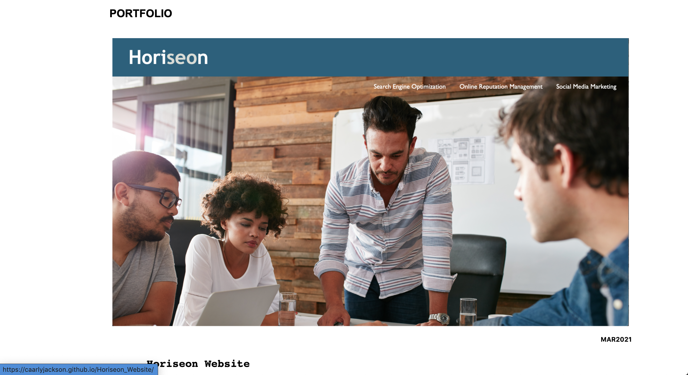

# portfolio-page

# Portfolio Page
# Carly Jackson

The following index and style sheet is my Portfolio Page, detailing my work and resume, as well as giving the viewer a quick preview into some simple facts about me, and giving them the oportunity to find me online.

The Navigation bar is fully functioning, with font effects when hovering over the buttons, and the link's fully engaged taking the viewer to the chosen header.

With a photo of myself, an About Me section is incorporated into my Portfolio Page, listing some simple facts about my interests and way of design.

My Resume is neatly and concisely listed, with a 'contact me!' section linking my details for LinkedIn, Email and Github.

The Portfolio feature to my page describes the nature of the project(s) I have worked on and created. The first, and so far only project, was a readjustmeant job of Horiseon's website: updating their HTML semantic structure, and in turn updating their style sheet.
A small preview of the completed project and website is presented with a quick description detailing the project's nature in my Portfolio Page.

# Please Note
When hovering over the:
        - Main heading
        - Navigation Bar options
        - Social media and Contact link options
        - Preview of the Horiseon website
image colours and font colours change. These are not previewed in the attached screenshots.

# LINK
https://caarlyjackson.github.io/portfolio-page/

# Screenshots

